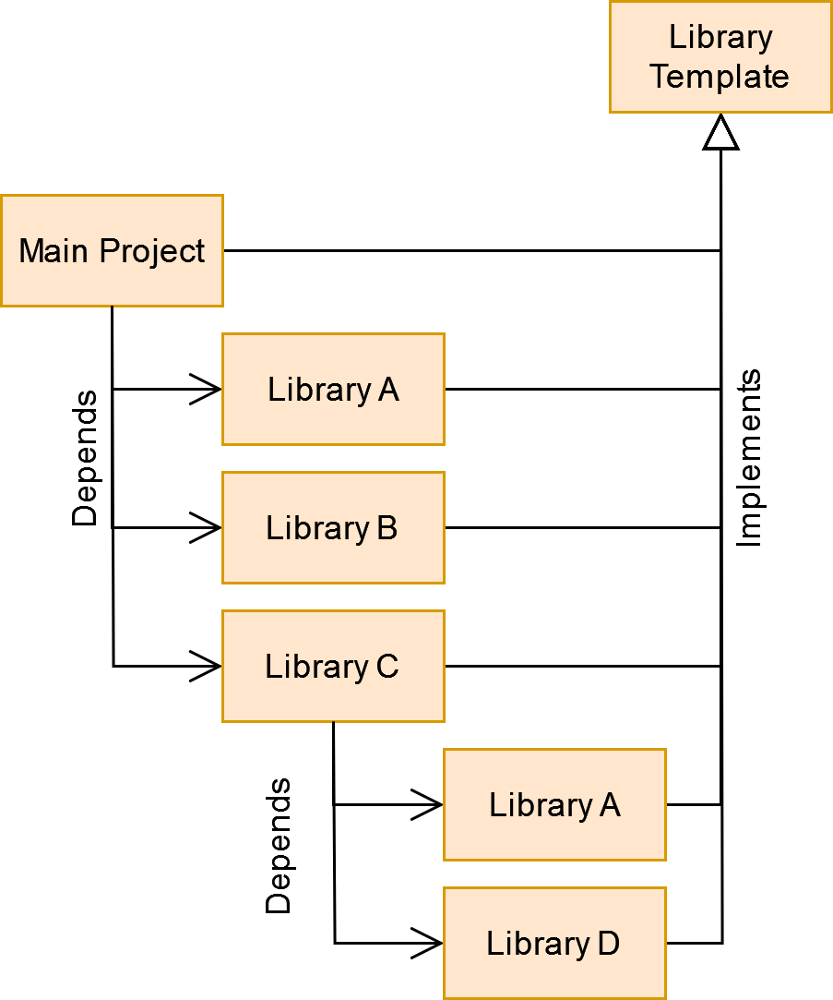

## Table of content
- [Overview](#overview)
- [Features](#features)
- [Note](#note)
- [Library structure](#library-structure)
- [References](#references)
- [Contact](#contact)
------------------------------------------------------
# QT cmake library template
## Overview
This is a template project used to create c++ libraries using CMake.
The goal of this template is, to build a modular and easy to use structure to develop applications and libraries.

The template is designed to generate both, dynamic and static builds of a library.
It is recommended to use the [Cmake Lib Creator](https://github.com/KROIA/CmakeLibCreator) to create and manage the library files.



The image shows how this template can be used.
An application consists of several libraries, which in turn can consist of several libraries.
This template makes it as easy as possible to integrate new libraries

## Features

- Contains a Info class, that contains library infos, [see Library Info](documentation/coreFolder.md/#LibraryName_info.h).
- Builtin settings to use the [easy_profiler](https://github.com/yse/easy_profiler), [see Easy Profiler integration](documentation/EasyProfilerIntegration.md).
- Example main project that integrates the library
- Example UnitTest project using a simple [Unit Test Library](https://github.com/KROIA/UnitTest).

--------
## Note
Please read [this section](documentation/generalInfoForSourceFiles.md) to learn how the **USER_SECTION_START** and **USER_SECTION_END** works, before you **change any template file**.

--------
## Library structure
The folderstructure of a library using this template looks like this:<br>
``` 
├───cmake
├───core
│   ├───inc
│   ├───resources
│   │   └───icons
│   └───src
├───dependencies
├───examples
│   └───LibraryExample
└───unitTests
    └───ExampleTest
        └───tests
```
- **cmake folder**
This folder contains cmake files that are used by the library template, do not change them.
- **[core folder](documentation/coreFolder.md)**
- **[examples folder](documentation/examplesFolder.md)**
- **[unitTests folder](documentation/unitTestsFolder.md)**


## References
- [Cmake Lib Creator](https://github.com/KROIA/CmakeLibCreator)
- [easy_profiler](https://github.com/yse/easy_profiler)

## Contact
alexkrieg@gmx.ch
