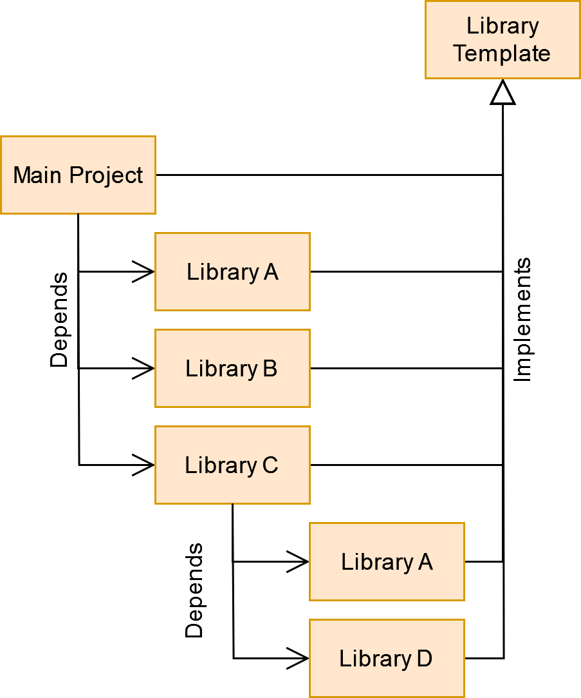

## Overview
- [QT cmake library template](#qt-cmake-library-template)
  - [Overview](#overview)
  - [Features](#features)
  - [How to use](documentation/HowToUse.md)
  - [How to use a library made from this template](documentation/HowToUseALibrary.md)
  - [Common problems](documentation/CommonProblems.md)
  - [References](#references)
  - [Contact](#contact)
  
---
# QT cmake library template
## Overview
This is a template project used to create c++ libraries for Qt Applications based on CMake.
The goal of this template is, to build a modular and easy to use structure to develop applications and libraries.

The template is designed to generate both, dynamic and static builds of a library.
It is recommended to use the [Cmake Lib Creator](https://github.com/KROIA/CmakeLibCreator) to create and manage the library files.

    

The image shows how this template can be used.
An application consists of several libraries, which in turn can consist of several libraries.
This template makes it as easy as possible to integrate new libraries.

---
## Features
* Predefined library headers to provide
  * [Profiling capability](documentation/EasyProfilerIntegration.md)
  * [Logging capability](documentation/LoggerIntegration.md)
  * [Library information](documentation/CoreFolder.md/#LibraryName_info.h).
* Example project that integrates the library.
You can add as many examples as you want.
[click here for more informations](documentation/ExamplesFolder.md)
* Example UnitTest project using a simple [Unit Test Library](https://github.com/KROIA/UnitTest).
[click here for more informations](documentation/UnitTestsFolder.md)

---
## How to use
[click here to visit this chapter](documentation/HowToUse.md)
## How to use a library made from this template
[click here to visit this chapter](documentation/HowToUseALibrary.md)
## Common problems
[click here to visit this chapter](documentation/CommonProblems.md)

## References
- [Cmake Lib Creator](https://github.com/KROIA/CmakeLibCreator)
- [easy_profiler](https://github.com/yse/easy_profiler)

## Contact
alexkrieg@gmx.ch
