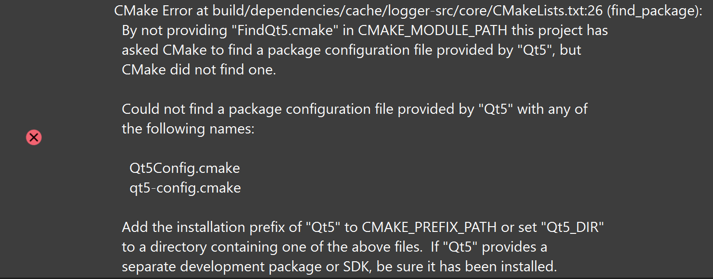
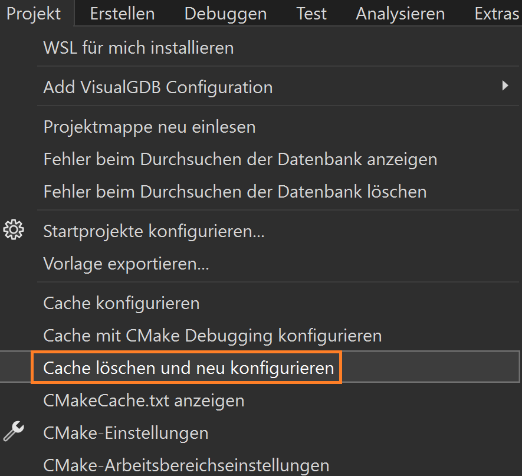
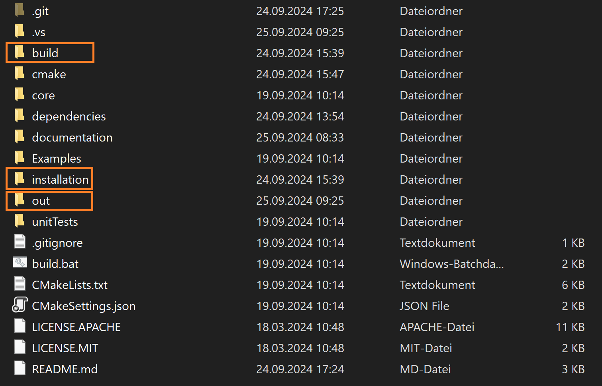
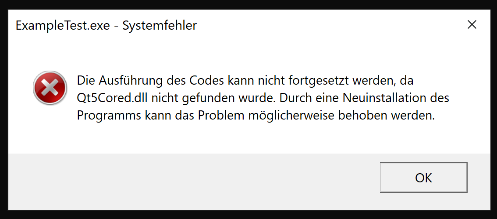
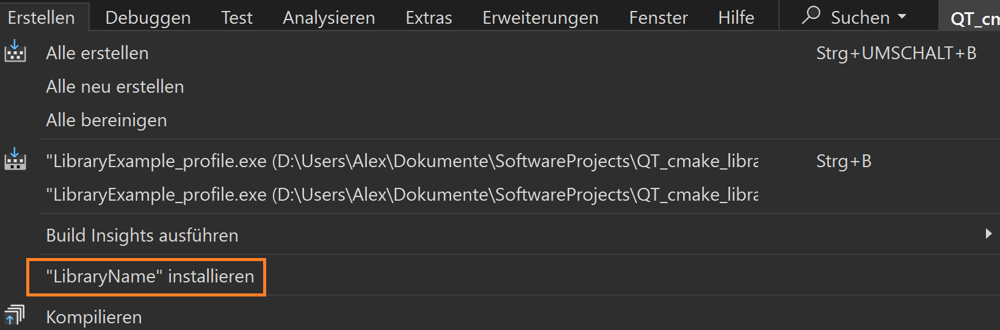

# Common problems
Bellow you can find some common erros working with a project, using this themplate.
If your problem is not listed here, please contact me for support.

## Problems
* [CMake](#cmake)
  * [Can't find Qt](#cant-find-qt)
  * [My problem is not listed](#my-problem-is-not-listed)
* [Qt](#qt)
  * [Missing Qt dll's](#missing-qt-dlls)
* [Visual Studio](#visual-studio)
  * [Can't reconfigure and run](#cant-reconfigure-and-run)


---
## CMake
Problems related to CMake can be found here
### Can't find Qt
> <p style="font-size: 5px;">CTRL+F Keywords:<br>Could not find a package configuration file provided by "Qt5" with any of the following names Qt5Config.cmake  qt5-config. make find_package By not providing "FindQt5.cmake" in CMAKE_MODULE_PATH this project has asked CMake to find a package configuration file provided by "Qt5", but CMake did not find one.</p>

<div style="text-align: center;">
    
</div>
No QT installation was found.<br>

* Check if QT is installed
* Check the path of the QT installation
 by default, the installation path shuld be **C:\Qt**.
 If Qt is installed in an other path, open the root CMakeLists.txt file and change the setting:

 ``` cmake
set_if_not_defined(QT_INSTALL_BASE "C:/PathToQt")
 ```
### FetchContent.cmake
If you se any error related to **FetchContent.cmake**, means that CMake has problems to download the dependencies.
Sometimes this error pops up and goes away after trying to delete the CMake cashe and reconfigure multiple times.

### QtLocator.cmake
#### Can't find QT installation
```
Fehler		CMake Error at cmake/QtLocator.cmake:73 (message):
  Can't find QT installation.  Path: C:/Qt/5.1.1 does not exist		
```

The required Qt version is not installed.
Install the required version or change the required version in the root CMakeLists.txt to a version you have installed or to "autoFind". <br> [Click here for more infos](ConfigureTheProject.md)


### My problem is not listed
Some CMake problems are difficult to tackle, some of them are strange. If I encounter such problems, i do the following steps. If one step does not work, go to the next step.
 1) **Try to reconfigure the CMake cache**
    <div style="text-align: center;">
        
    </div>

 2) **Deleting the CMake cache manually**
    Go to your Projects main folder and delete all folders which are marked with the orange box.
    You may need to close Visual Studio to do so.
    After you deleted the folders, go back to Visual Studio and reconfigure the Project **Project->Configure cache**
    <div style="text-align: center;">
        
    </div>


---
## Qt
### Missing Qt dll's
> <p style="font-size: 5px;">CTRL+F Keywords:<br>Qt5Cored.dll Qt5Core.dll crash install</p>

<div style="text-align: center;">
    
</div>

 If you run an executable of your library and encounter any popup that informs you that some Qt dll's are missing, you have to **run the installation process**.

<div style="text-align: center;">
    
</div>


---
## Visual Studio
### Can't reconfigure and run
If Visual studio doesn't let you reconfigure the project and you also can't run your executables, deleting the .vs folder in your projects root directory may help. You have to close Visual Studio to delete the folder.