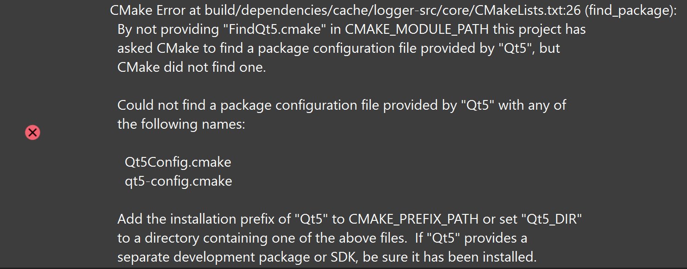
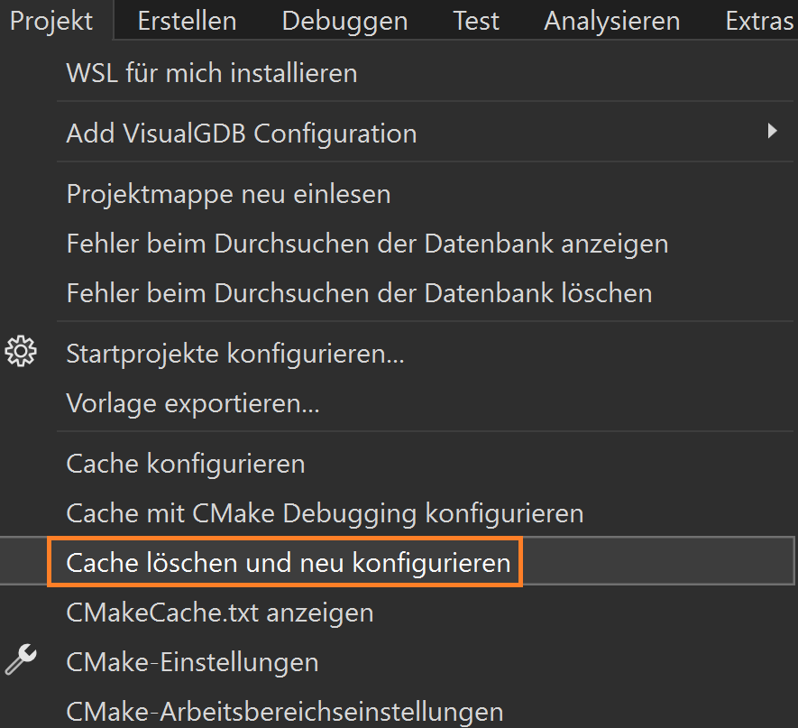
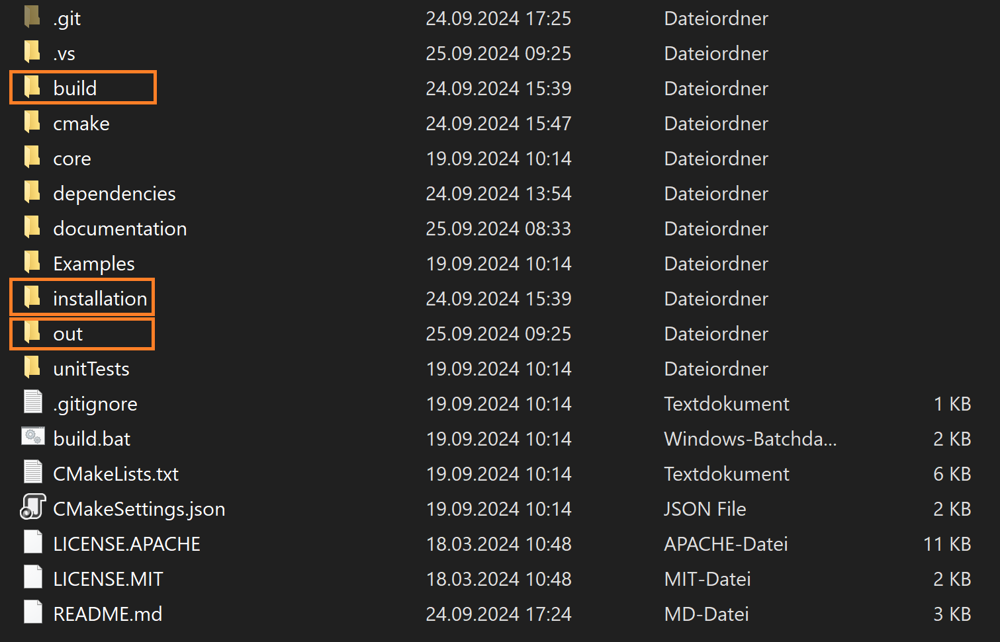
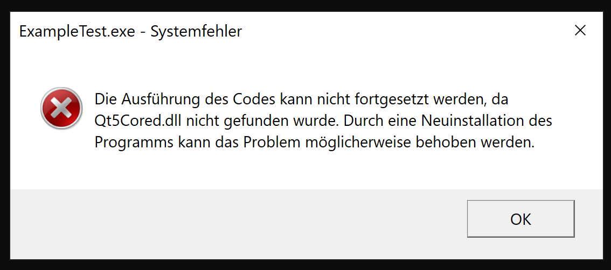
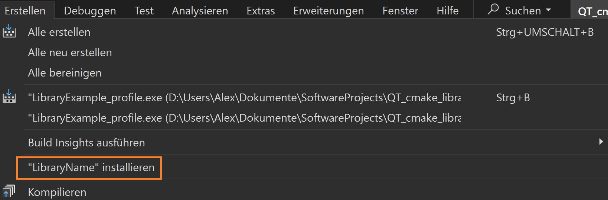

# Common problems
Bellow you can find some common erros working with a project, using this themplate.
If your problem is not listed here, please contact me for support.

## Problems
* [CMake](#cmake)
  * [Can't find Qt](#cant-find-qt)
  * [My problem is not listed](#my-problem-is-not-listed)
* [Qt](#qt)
  * [Missing Qt dll's](#missing-qt-dlls)
* [Visual Studio](#visual-studio)
  * [Can't reconfigure and run](#cant-reconfigure-and-run)


---
## CMake
Problems related to CMake can be found here
### Can't find Qt
> <p style="font-size: 5px;">CTRL+F Keywords:<br>Could not find a package configuration file provided by "Qt5" with any of the following names Qt5Config.cmake  qt5-config. make find_package By not providing "FindQt5.cmake" in CMAKE_MODULE_PATH this project has asked CMake to find a package configuration file provided by "Qt5", but CMake did not find one.</p>

<div style="text-align: center;">
    
</div>
No QT installation was found.<br>

* Check if QT is installed
* Check the path of the QT installation
 by default, the installation path should be **C:\Qt**.
 If Qt is installed in an other path, open the root CMakeLists.txt file and change the setting:

 ``` cmake
set_if_not_defined(QT_INSTALL_BASE "C:/PathToQt")
 ```
### FetchContent.cmake
If you se any error related to **FetchContent.cmake**, means that CMake has problems to download the dependencies.
Sometimes this error pops up and goes away after trying to delete the CMake cashe and reconfigure multiple times.

### QtLocator.cmake
#### Can't find QT installation
```
Fehler		CMake Error at cmake/QtLocator.cmake:73 (message):
  Can't find QT installation.  Path: C:/Qt/5.1.1 does not exist		
```

The required Qt version is not installed.
Install the required version or change the required version in the root CMakeLists.txt to a version you have installed or to "autoFind". <br> [Click here for more infos](ConfigureTheProject.md)


### CMake 4.x rejects old policy versions (easy_profiler and similar)
> <p style="font-size: 5px;">CTRL+F Keywords:<br>Compatibility with CMake < 3.5 has been removed CMAKE_POLICY_VERSION_MINIMUM easy_profiler cmake_minimum_required</p>

CMake 4.x removed compatibility with policies older than 3.5. Dependencies pinned to a tag whose `cmake_minimum_required(VERSION 2.x)` still applies (for example easy_profiler v2.1.0) will fail the first configure with a message ending in:

```
... add -DCMAKE_POLICY_VERSION_MINIMUM=3.5 to try configuring anyway.
```

`build.bat` already passes `"-DCMAKE_POLICY_VERSION_MINIMUM=3.5"` (quoted) to cmake, so a normal `build.bat` run is unaffected. The flag is a no-op on CMake < 4.0.

**PowerShell quoting trap.** If you invoke cmake manually from PowerShell, the flag MUST be quoted:

```powershell
cmake "-DCMAKE_POLICY_VERSION_MINIMUM=3.5" ...
```

Unquoted, PowerShell parses `-DCMAKE_POLICY_VERSION_MINIMUM=3.5` as the expression `(3).5` (member access on the integer `3`), so cmake only ever receives `-DCMAKE_POLICY_VERSION_MINIMUM=3` and the configure still fails — silently misleading. cmd.exe and Git Bash do not have this trap, but quoting works there too.

### Git Bash mangles slash-prefixed cmake flags
> <p style="font-size: 5px;">CTRL+F Keywords:<br>MSYS path conversion /EHsc /MP C1083 source file not opened Files/Git Git Bash MSYS_NO_PATHCONV</p>

If you invoke cmake manually from Git Bash on Windows with a slash-prefixed compiler flag, for example `cmake -DCMAKE_CXX_FLAGS="/EHsc /MP" ...`, MSYS rewrites the leading `/` into a Windows path and cmake ends up receiving something like `C:/Program Files/Git/EHsc`. The build then fails with:

```
error C1083: source file not opened: "Files/Git/EHsc"
```

**Workaround.** Either prefix the command with `MSYS_NO_PATHCONV=1` to disable the rewrite, or run the same command from `cmd.exe` or PowerShell, which do not perform path conversion:

```bash
MSYS_NO_PATHCONV=1 cmake -DCMAKE_CXX_FLAGS="/EHsc /MP" ...
```

`build.bat` is unaffected because it runs in `cmd.exe`.

### My problem is not listed
Some CMake problems are difficult to tackle, some of them are strange. If I encounter such problems, i do the following steps. If one step does not work, go to the next step.
 1) **Try to reconfigure the CMake cache**
    <div style="text-align: center;">
        
    </div>

 2) **Deleting the CMake cache manually**
    Go to your Projects main folder and delete all folders which are marked with the orange box.
    You may need to close Visual Studio to do so.
    After you deleted the folders, go back to Visual Studio and reconfigure the Project **Project->Configure cache**
    <div style="text-align: center;">
        
    </div>


---
## Qt
### Missing Qt dll's
> <p style="font-size: 5px;">CTRL+F Keywords:<br>Qt5Cored.dll Qt5Core.dll crash install</p>

<div style="text-align: center;">
    
</div>

 If you run an executable of your library and encounter any popup that informs you that some Qt dll's are missing, you have to **run the installation process**.

<div style="text-align: center;">
    
</div>


---
## Visual Studio
### Can't reconfigure and run
If Visual studio doesn't let you reconfigure the project and you also can't run your executables, deleting the .vs folder in your projects root directory may help. You have to close Visual Studio to delete the folder.