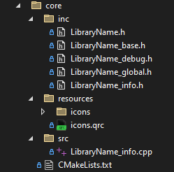

# Folder core
This folder contains the source code of the library, it is splitted in **inc**, **src** and **resources**<br>
- **inc** This is the folder that contains all header files.
- **src** This is the folder that contains all cpp source files.
- **resources** This is the folder that contains resources such as icons, images...
<div style="text-align: center;">
	
</div>

## Files
### LibraryName.h
This header will be included in any project that uses your library.
It only contains the includes of all headers you want to expose to the user.
``` C++
#pragma once

/// USER_SECTION_START 1

/// USER_SECTION_END

#include "LibraryName_info.h"

/// USER_SECTION_START 2

/// USER_SECTION_END
``` 

Edited during development of the library:
``` C++
#pragma once

/// USER_SECTION_START 1

/// USER_SECTION_END

#include "LibraryName_info.h"

/// USER_SECTION_START 2
#include "FileFromTheLibrary1.h"
#include "FileFromTheLibrary2.h"
/// USER_SECTION_END
``` 

### LibraryName_base.h
This header is the base include in every header from the library.
It includes all headers that should be available to all headers from the library.
``` C++
#pragma once

/// USER_SECTION_START 1

/// USER_SECTION_END

#include "LibraryName_global.h"
#include "LibraryName_debug.h"
#include "LibraryName_info.h"

/// USER_SECTION_START 2

/// USER_SECTION_END
``` 
### LibraryName_debug.h
This header is used to debug/profile your library.<br>
It contains usefull macros to write to the console or to create profiling blocks.<br>
Visit the [profiling](EasyProfilerIntegration.md) section for more infos about profiling.<br>
Visit the [Logging](loggerIntegration.md) section for more infos about the logging integration.<br>


### LibraryName_global.h
This header contains the dllimport/export switch.
``` C++
...
#ifndef BUILD_STATIC
    #if defined(LIBRARY_NAME_LIB)
        #define LIBRARY_NAME_API __declspec(dllexport)
    #else
        #define LIBRARY_NAME_API __declspec(dllimport)
    #endif
#else
    #define LIBRARY_NAME_API
#endif
...
``` 

It also defines a macro that can be used to specify if a parameter of a function is not used inside the function.
``` C++
...
#define LIBRARY_NAME_SHORT_UNUSED(x) (void)x;
...
``` 

To help a little to find some programming errors, some warnings are changed to errors.
``` C++
...
#if defined(LIBRARY_NAME_LIB)
    #pragma warning (error : 4715) // not all control paths return a value
    #pragma warning (error : 4700) // uninitialized local variable used
    #pragma warning (error : 4244) // implicit type conversion (possible loss of data)
    #pragma warning (error : 4100) // unreferenced formal parameter
    #pragma warning (error : 4018) // signed/unsigned mismatch
    #pragma warning (error : 4996) // deprecated / unsafe function call
    #pragma warning (error : 4456) // declaration hides previous local declaration
    #pragma warning (error : 4065) // switch contains 'default' but no 'case' labels
    #pragma warning (error : 4189) // local variable initialized but not referenced
    #pragma warning (error : 4172) // returning address of local variable or temporary
#endif
...
``` 
If you do not want that the warnings are changed to errors, you can do the following trick.
Using the user sections, you can comment the whole section out.
``` C++
...
/// USER_SECTION_START 4
/*
/// USER_SECTION_END

#if defined(LIBRARY_NAME_LIB)
    #pragma warning (error : 4715) // not all control paths return a value
    #pragma warning (error : 4700) // uninitialized local variable used
    #pragma warning (error : 4244) // implicit type conversion (possible loss of data)
    #pragma warning (error : 4100) // unreferenced formal parameter
    #pragma warning (error : 4018) // signed/unsigned mismatch
    #pragma warning (error : 4996) // deprecated / unsafe function call
    #pragma warning (error : 4456) // declaration hides previous local declaration
    #pragma warning (error : 4065) // switch contains 'default' but no 'case' labels
    #pragma warning (error : 4189) // local variable initialized but not referenced
    #pragma warning (error : 4172) // returning address of local variable or temporary
#endif

/// USER_SECTION_START 5
*/
/// USER_SECTION_END
...
``` 

### LibraryName_info.h
This header contains the class ```LibraryInfo```, it contains some information about the library.
It also contains a function to create a QWidget with the library info.
Version numbers and the library name are auto-generated from the `LIBRARY_VERSION` and `LIBRARY_NAME` variables in CMakeLists.txt via the `LibraryName_meta.h` template.
``` C++
...
namespace LibraryNamespace
{

/// USER_SECTION_START 4

/// USER_SECTION_END

	// Compile-time metadata about the library (non-instantiable).
	class LIBRARY_NAME_API LibraryInfo
	{
		LibraryInfo() = delete;
		LibraryInfo(const LibraryInfo&) = delete;
	public:

		// Semantic version triplet with full comparison operators.
		struct Version
		{
			int major;
			int minor;
			int patch;

			bool operator<(const Version& other) const;
			bool operator==(const Version& other) const;
			bool operator!=(const Version& other) const;
			bool operator>(const Version& other) const;
			bool operator<=(const Version& other) const;
			bool operator>=(const Version& other) const;

			// Returns the version formatted as "MM.mm.pppp" with leading zeros.
			std::string toString() const;
		};

		// Version — auto-generated from LIBRARY_VERSION in CMakeLists.txt.
		static constexpr int versionMajor               = LibraryName_VERSION_MAJOR;
		static constexpr int versionMinor               = LibraryName_VERSION_MINOR;
		static constexpr int versionPatch               = LibraryName_VERSION_PATCH;

		static constexpr Version version{ versionMajor, versionMinor, versionPatch };

		// Metadata — edit these fields to describe your library.
		static constexpr const char* name               = LibraryName_LIBRARY_NAME;
		static constexpr const char* author             = "";
		static constexpr const char* email              = "";
		static constexpr const char* website            = "";
		static constexpr const char* license            = "MIT";
		static constexpr const char* compilationDate    = __DATE__;
		static constexpr const char* compilationTime    = __TIME__;

		// Print all metadata to stdout.
		static void printInfo();
		// Print all metadata to the given stream.
		static void printInfo(std::ostream& stream);
		// Return all metadata as a multi-line string.
		static std::string getInfoStr();

		// Create a QWidget displaying the library metadata.
		// Requires QT_ENABLE=ON and "Widgets" in QT_MODULES; returns nullptr otherwise.
		// The caller takes ownership of the widget.
		static QWidget *createInfoWidget(QWidget* parent = nullptr, bool disableHyperlink = false);
        ...
    };
    ...
}
...
``` 
