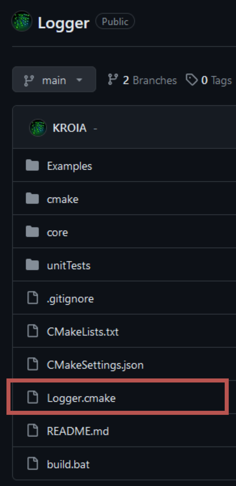
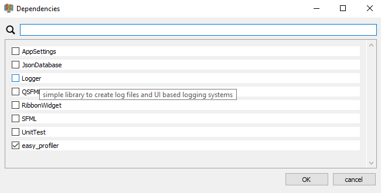

# Dependencies {#dependencies}
To add external dependencies, place a `.cmake` file for each dependency inside the folder:
**LibraryRoot/dependencies**<br>
Each dependency `.cmake` file specifies where CMake can download the sources.
The downloaded sources are cached in:
**LibraryRoot/build/.../dependencies/cache**<br>

## Overview
- [Requirements](#requirements)
- [How to add a dependency to my library project?](#how-to-add-a-dependency-to-my-library-project)
- [Create a dependency file (standard library)](#create-a-dependency-file)
- [Create a dependency file (external / non-template library)](#Create-a-dependency-file-from-special-repository)
- [Local dependencies](#local-dependencies)
- [Dependency load order](#dependency-load-order)
- [Dependency CMake file example](#dependencyCmakeFile)

## Requirements
- Your dependency must be available on GitHub (or as a local folder — see [Local dependencies](#local-dependencies))
- You need a [dependency CMake file](#dependencyCmakeFile) for your dependency
  
## How to add a dependency to my library project?
1. Check if your dependency already has a dependency `.cmake` file.
   For libraries created with this template, the file is usually in the repository root:<br>
   <br>
   If no such file is available, [click here](#Create-a-dependency-file)

2. Add the dependency `.cmake` file to the directory:
   **LibraryRoot/dependencies**

3. Rebuild the CMake cache by clicking 
   **Visual Studio -> Project -> "Clear cache and reconfigure"**
   This will download the dependency.


## Create a dependency file
If your dependency is built using this library template you can use the simplified `downloadStandardLibrary()` macro.
**If** your dependency is **not created using this library template, [click here](#Create-a-dependency-file-from-special-repository)**.

1. Create a new `.cmake` text document and give it the name of the dependency.
2. Copy the content from the [template file](https://raw.githubusercontent.com/KROIA/QT_cmake_library_template/main/dependencies/DependencyTemplate.cmake).
3. Change the description to fit your dependency. The description is used as tooltip in the [CMake Library Creator](https://github.com/KROIA/CmakeLibCreator).<br>
    ``` cmake
    ## description: This is an example description visible as tooltip in the CmakeLibraryCreator
    ```
4. Change the variables **LIB_NAME**, **LIB_MACRO_NAME**, **GIT_REPO** and **GIT_TAG**.<br>
    - **LIB_NAME**: The name of the library. You can find the name in the dependency's root CMakeLists.txt:<br>
    ``` cmake
    ...
    # Name of the library
    set(LIBRARY_NAME Logger)                   # <AUTO_REPLACED>
    ...
    ```
    - **LIB_MACRO_NAME**: Macro name that is defined by the compiler to enable code sections inside the library. For example, enabling the Logger integration when available. If left empty, it is auto-generated from LIB_NAME (e.g. `Logger` becomes `LOGGER_LIBRARY_AVAILABLE`).<br>
    - **GIT_REPO**: Link to the repository of the dependency.
    - **GIT_TAG**: The name of the tag/branch you want to use.
5. Save the file.
6. Recommended: Copy the created file to the repository's root folder so others who want to use your library can download your dependency `.cmake` file.<br>
   Additionally you can contact me so I can add your dependency file to the list of all dependencies available for use in the [CMake Library Creator](https://github.com/KROIA/CmakeLibCreator).<br>
   The dependency file will then be saved to the [Dependencies repository](https://github.com/KROIA/QT_cmake_library_template/tree/dependencies).

### Dependency file using `downloadStandardLibrary()`

The `downloadStandardLibrary()` macro (defined in `cmake/utility.cmake`) handles the complete FetchContent workflow for libraries created with this template. It:

- Resolves the source: **local folder** → **cached download** → **git download** (see [Local dependencies](#local-dependencies))
- Calls `FetchContent_MakeAvailable` to build the dependency
- Auto-discovers the include path (`core/inc`)
- Adds the library targets to the correct build profiles (shared, static, static-profile)
- Auto-generates `LIB_MACRO_NAME` if not set

``` cmake
## description: Simple library to create log files and UI based logging systems

function(dep LIBRARY_MACRO_NAME SHARED_LIB STATIC_LIB STATIC_PROFILE_LIB INCLUDE_PATHS)
    # Define the git repository and tag to download from
    set(LIB_NAME Logger)
    set(LIB_MACRO_NAME LOGGER_LIBRARY_AVAILABLE)
    set(GIT_REPO https://github.com/KROIA/Logger.git)
    set(GIT_TAG main)
    set(NO_EXAMPLES True)	
    set(NO_UNITTESTS True)
    set(ADDITIONAL_INCLUDE_PATHS )

    downloadStandardLibrary()
endfunction()

dep(DEPENDENCY_NAME_MACRO 
    DEPENDENCIES_FOR_SHARED_LIB 
    DEPENDENCIES_FOR_STATIC_LIB 
    DEPENDENCIES_FOR_STATIC_PROFILE_LIB 
    DEPENDENCIES_INCLUDE_PATHS)
```

**Parameters you can set before calling `downloadStandardLibrary()`:**

| Variable | Purpose | Default |
|----------|---------|---------|
| `LIB_NAME` | FetchContent name and folder name | (required) |
| `LIB_MACRO_NAME` | Compile definition added to consumers | Auto-generated from `LIB_NAME` |
| `GIT_REPO` | Git repository URL | (required) |
| `GIT_TAG` | Git tag, branch, or commit hash | (required) |
| `NO_EXAMPLES` | Disable building examples of the dependency | `False` |
| `NO_UNITTESTS` | Disable building unit tests of the dependency | `False` |
| `ADDITIONAL_INCLUDE_PATHS` | Extra include directories | (empty) |
| `ADDITIONAL_SHARED_LIB_DEPENDENCIES` | Extra link libraries for the shared profile | (empty) |
| `ADDITIONAL_STATIC_LIB_DEPENDENCIES` | Extra link libraries for the static profile | (empty) |
| `ADDITIONAL_STATIC_PROFILE_LIB_DEPENDENCIES` | Extra link libraries for the static-profile target | (empty) |


## Create a dependency file from special repository {#Create-a-dependency-file-from-special-repository}
To demonstrate how to create the dependency `.cmake` file for a non-template library, I use the [easy_profiler library](https://github.com/yse/easy_profiler) as example.

1. Create a new `.cmake` text document and give it the name of the dependency.
2. Copy the content from the [template file](https://raw.githubusercontent.com/KROIA/QT_cmake_library_template/main/dependencies/DependencyTemplate.cmake).
3. Change the description to fit your dependency. The description is used as tooltip in the [CMake Library Creator](https://github.com/KROIA/CmakeLibCreator).<br>
    ``` cmake
    ## description: This is an example description visible as tooltip in the CmakeLibraryCreator
    ```
4. **Replace `downloadStandardLibrary()` with `downloadExternalLibrary()`** and adjust the variables **LIB_NAME**, **GIT_REPO** and **GIT_TAG**.
    - **LIB_NAME**: The name of the library — the CMake target name you need to link against.<br>
    - **GIT_REPO**: Link to the repository of the dependency.
    - **GIT_TAG**: The name of the tag/branch you want to use.<br>
    ``` cmake
    # Define the git repository and tag to download from
    set(LIB_NAME easy_profiler)
    set(GIT_REPO https://github.com/yse/easy_profiler.git)
    set(GIT_TAG develop)
    ```
    If your library does not exist on GitHub, remove the part with the FetchContent_Declare. You just need to make your library available in this file, using the LIB_NAME as target name.
    

5. Depending on your dependency, you may have to define/change some settings from the dependency. 
I recommend you test your dependency in a separate CMake project to know which settings have to be set in order for it to work.
   In the example of easy_profiler it would be the following changes:<br>
   ``` cmake
    # Deploy the Profiler GUI
    if(QT_ENABLE AND QT_DEPLOY)
        windeployqt(profiler_gui ${INSTALL_BIN_PATH})
    endif()

    set_target_properties(${LIB_NAME} PROPERTIES CMAKE_RUNTIME_OUTPUT_DIRECTORY ${RUNTIME_OUTPUT_DIRECTORY})
    set_target_properties(${LIB_NAME} PROPERTIES CMAKE_LIBRARY_OUTPUT_DIRECTORY ${RUNTIME_OUTPUT_DIRECTORY})
    set_target_properties(${LIB_NAME} PROPERTIES CMAKE_ARCHIVE_OUTPUT_DIRECTORY ${RUNTIME_OUTPUT_DIRECTORY})
    set_target_properties(${LIB_NAME} PROPERTIES DEBUG_POSTFIX ${DEBUG_POSTFIX_STR})
    target_compile_definitions(${LIB_NAME} PUBLIC EASY_PROFILER_STATIC)
    ```
    - You can use the **QT_ENABLE** and **QT_DEPLOY** parameters, which are defined in the root CMakeLists.txt of your library, to check if Qt is enabled and if the deployment is activated.
    In the case of easy_profiler, which contains a Qt application, I want to deploy that executable so I can use the easy_profiler GUI.
    To do so, the function **windeployqt** is called.

    - The output path for easy_profiler is also changed...
    - A custom target definition to make easy_profiler a static build is also done here.

    - If you only need that dependency for certain build configurations (shared, static, static-profile),
      you can specify which configuration uses your dependency with this code:<br>
    ``` cmake
    # Add this library to the specific configurations of this project
    list(APPEND DEPENDENCIES_FOR_SHARED_LIB )   # easy_profiler is not needed for the shared profile
    list(APPEND DEPENDENCIES_FOR_STATIC_LIB )   # easy_profiler is not needed for the static profile
    list(APPEND DEPENDENCIES_FOR_STATIC_PROFILE_LIB ${LIB_NAME}) # only used for static profiling profile
    ```

6. Save the file.
7. Optional: you can contact me so I can add your dependency file to the list of all dependencies available for use in the [CMake Library Creator](https://github.com/KROIA/CmakeLibCreator).
   The dependency file will then be saved to the [dependencies repository](https://github.com/KROIA/QT_cmake_library_template/tree/dependencies).


---

## Local dependencies {#local-dependencies}

When developing multiple libraries at the same time (e.g. your main project and one of its dependencies), you often want CMake to use the **local source folder** instead of downloading from Git. This makes the edit-compile-test loop immediate — changes in the dependency are picked up on the next build without committing or pushing.

### How it works

The dependency system uses a three-tier resolution strategy:

1. **Local override** — If `USE_LOCAL_DEPENDENCIES=ON` and the folder `LOCAL_DEPENDENCIES_PATH/<LIB_NAME>` exists, CMake uses it as the source directory. No network access is needed.
2. **Cached download** — If the dependency was previously downloaded into the FetchContent cache directory, it is reused without a git fetch.
3. **Git download** — The dependency is cloned from the git repository and tag specified in the `.cmake` file.

This applies to both `downloadStandardLibrary()` and `downloadExternalLibrary()` macros as well as the `smartDeclare()` macro.

### Setting up a local development workspace

Arrange your projects as sibling folders under a common parent:

```
Projects/              ← LOCAL_DEPENDENCIES_PATH points here
├── Logger/            ← Dependency library (its own template project)
│   ├── CMakeLists.txt
│   ├── core/
│   └── ...
├── AppSettings/       ← Another dependency
│   └── ...
└── MyProject/         ← Your main project
    ├── CMakeLists.txt
    ├── dependencies/
    │   ├── Logger.cmake
    │   └── AppSettings.cmake
    └── core/
```

### Enabling local dependencies

Set two CMake variables — either on the command line, in CMakePresets.json, or in CMakeSettings.json:

``` cmake
-DUSE_LOCAL_DEPENDENCIES=ON
-DLOCAL_DEPENDENCIES_PATH="../"
```

- **`USE_LOCAL_DEPENDENCIES`** — Master switch. When `OFF` (the default), dependencies are always downloaded from Git.
- **`LOCAL_DEPENDENCIES_PATH`** — Root folder containing local dependency clones. Each dependency must be in a sub-folder whose name matches `LIB_NAME` in the `.cmake` file. The path can be **absolute** or **relative to the project root** (the directory containing the top-level CMakeLists.txt).

#### Example: CMakePresets.json

``` json
{
  "configurePresets": [
    {
      "name": "x64-Debug-Local",
      "inherits": "x64-Debug",
      "cacheVariables": {
        "USE_LOCAL_DEPENDENCIES": "ON",
        "LOCAL_DEPENDENCIES_PATH": "../"
      }
    }
  ]
}
```

#### Example: CMakeSettings.json (Visual Studio)

``` json
{
  "configurations": [
    {
      "name": "x64-Debug-Local",
      "generator": "Ninja",
      "configurationType": "Debug",
      "buildRoot": "${projectDir}\\build\\${name}",
      "cmakeCommandArgs": "-DUSE_LOCAL_DEPENDENCIES=ON -DLOCAL_DEPENDENCIES_PATH=\"../\"",
      "inheritEnvironments": [ "msvc_x64_x64" ]
    }
  ]
}
```

#### Example: command line

``` bash
cmake -B build -G Ninja -DUSE_LOCAL_DEPENDENCIES=ON -DLOCAL_DEPENDENCIES_PATH="../"
```

### How path resolution works

| `LOCAL_DEPENDENCIES_PATH` | Resolved to |
|---------------------------|-------------|
| `../` | `<project-root>/../` (relative to `CMAKE_SOURCE_DIR`) |
| `C:/Projects/libs` | `C:/Projects/libs` (absolute, used as-is) |
| *(empty)* | Local mode disabled even if `USE_LOCAL_DEPENDENCIES=ON` |

The folder name inside `LOCAL_DEPENDENCIES_PATH` must match the `LIB_NAME` set in the dependency `.cmake` file. For example, if `LIB_NAME` is `Logger`, the local path must be `LOCAL_DEPENDENCIES_PATH/Logger/`.

### Transitive dependencies

When a dependency is itself built from this template and has its own dependencies, those transitive dependencies also use the local path automatically. The `USE_LOCAL_DEPENDENCIES` and `LOCAL_DEPENDENCIES_PATH` variables are set as CMake cache variables in the top-level project, so all sub-projects inherit them.

This means if your project depends on `LibA`, and `LibA` depends on `LibB`, both will be resolved from the local folder — as long as `LOCAL_DEPENDENCIES_PATH/LibA/` and `LOCAL_DEPENDENCIES_PATH/LibB/` exist.

### Tips

- **Switching between local and remote**: Simply toggle the `USE_LOCAL_DEPENDENCIES` flag. When set to `OFF`, the system falls back to cached or git downloads.
- **Clean dependency cache**: Use **Visual Studio → Project → "Delete cache and reconfigure"** to force a fresh download. This deletes the sentinel stamp file, which in turn wipes the FetchContent cache.
- **Only some dependencies local**: Place only the dependencies you want to develop locally in the `LOCAL_DEPENDENCIES_PATH` folder. Dependencies that are not found locally will automatically fall back to the cached or git download.


---

## Dependency load order {#dependency-load-order}

The file `dependencies/order.cmake` controls the order in which dependency `.cmake` files are loaded. This matters because some dependencies depend on others (e.g. Logger may need easy_profiler to be available first).

``` cmake
function(getOrder order)
    set(${order}
        easy_profiler.cmake
        Logger.cmake
        DependencyTemplate.cmake
        PARENT_SCOPE
    )
endfunction()
```

When you add a new dependency, add its `.cmake` filename to this list in the correct position.


---

### Dependency CMake File example {#dependencyCmakeFile}
Here you can see the content of the Logger library dependency `.cmake` file using the simplified `downloadStandardLibrary()` macro:<br>
``` cmake
## description: Simple library to create log files and UI based logging systems

function(dep LIBRARY_MACRO_NAME SHARED_LIB STATIC_LIB STATIC_PROFILE_LIB INCLUDE_PATHS)
    # Define the git repository and tag to download from
    set(LIB_NAME Logger)
    set(LIB_MACRO_NAME LOGGER_LIBRARY_AVAILABLE)
    set(GIT_REPO https://github.com/KROIA/Logger.git)
    set(GIT_TAG main)
    set(NO_EXAMPLES True)
    set(NO_UNITTESTS True)
    set(ADDITIONAL_INCLUDE_PATHS )

    downloadStandardLibrary()
endfunction()

dep(DEPENDENCY_NAME_MACRO
    DEPENDENCIES_FOR_SHARED_LIB 
    DEPENDENCIES_FOR_STATIC_LIB 
    DEPENDENCIES_FOR_STATIC_PROFILE_LIB 
    DEPENDENCIES_INCLUDE_PATHS)
``` 

#### Description text
``` cmake
## description: Simple library to create log files and UI based logging systems
```
<br>
The description text will be visible as tooltip in the dependencies window of the [CMake Library Creator](https://github.com/KROIA/CmakeLibCreator).

#### Git parameters
``` cmake
# Define the git repository and tag to download from
set(LIB_NAME Logger)
set(GIT_REPO https://github.com/KROIA/Logger.git)
set(GIT_TAG main)
```
Parameters needed for the [FetchContent_Declare](https://cmake.org/cmake/help/latest/module/FetchContent.html) function from CMake.

#### Library configuration
``` cmake
set(NO_EXAMPLES True)
set(NO_UNITTESTS True)
```
These parameters are available for libraries created using this library template.
They activate/deactivate the inclusion of the examples and unit tests of the dependency.
Often both examples and unit tests are not needed and only produce compilation overhead.
It also eliminates the problem that sometimes examples or unit tests have the same CMake target name as those of the library you are working on, which would cause CMake configuration to fail.
