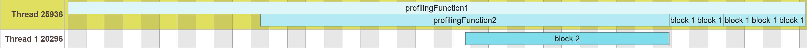

# Easy profiler integration
All credits to the [easy_profiler](https://github.com/yse/easy_profiler) project go its creator.

This library template contains 3 targets, one of which is used to enable profiling.<br>
All profiling settings can be found in the file **LibraryName_debug.h**.<br>


## Basic macros
``` C++
#ifdef LIBRARY_NAME_SHORT_PROFILING
	#include "easy/profiler.h"
	#include <easy/arbitrary_value.h> // EASY_VALUE, EASY_ARRAY are defined here

	#define LIBRARY_NAME_SHORT_PROFILING_BLOCK_C(text, color) EASY_BLOCK(text, color)
	#define LIBRARY_NAME_SHORT_PROFILING_NONSCOPED_BLOCK_C(text, color) EASY_NONSCOPED_BLOCK(text, color)
	#define LIBRARY_NAME_SHORT_PROFILING_END_BLOCK EASY_END_BLOCK
	#define LIBRARY_NAME_SHORT_PROFILING_FUNCTION_C(color) EASY_FUNCTION(color)
	#define LIBRARY_NAME_SHORT_PROFILING_BLOCK(text, colorStage) LIBRARY_NAME_SHORT_PROFILING_BLOCK_C(text,profiler::colors::  colorStage)
	#define LIBRARY_NAME_SHORT_PROFILING_NONSCOPED_BLOCK(text, colorStage) LIBRARY_NAME_SHORT_PROFILING_NONSCOPED_BLOCK_C(text,profiler::colors::  colorStage)
	#define LIBRARY_NAME_SHORT_PROFILING_FUNCTION(colorStage) LIBRARY_NAME_SHORT_PROFILING_FUNCTION_C(profiler::colors:: colorStage)
	#define LIBRARY_NAME_SHORT_PROFILING_THREAD(name) EASY_THREAD(name)

	#define LIBRARY_NAME_SHORT_PROFILING_VALUE(name, value) EASY_VALUE(name, value)
	#define LIBRARY_NAME_SHORT_PROFILING_TEXT(name, value) EASY_TEXT(name, value)

#else
	#define LIBRARY_NAME_SHORT_PROFILING_BLOCK_C(text, color)
	#define LIBRARY_NAME_SHORT_PROFILING_NONSCOPED_BLOCK_C(text, color)
	#define LIBRARY_NAME_SHORT_PROFILING_END_BLOCK
	#define LIBRARY_NAME_SHORT_PROFILING_FUNCTION_C(color)
	#define LIBRARY_NAME_SHORT_PROFILING_BLOCK(text, colorStage)
	#define LIBRARY_NAME_SHORT_PROFILING_NONSCOPED_BLOCK(text, colorStage)
	#define LIBRARY_NAME_SHORT_PROFILING_FUNCTION(colorStage)
	#define LIBRARY_NAME_SHORT_PROFILING_THREAD(name)

	#define LIBRARY_NAME_SHORT_PROFILING_VALUE(name, value)
	#define LIBRARY_NAME_SHORT_PROFILING_TEXT(name, value)
#endif

...
// Different color stages
#define LIBRARY_NAME_SHORT_COLOR_STAGE_1 50
#define LIBRARY_NAME_SHORT_COLOR_STAGE_2 100
#define LIBRARY_NAME_SHORT_COLOR_STAGE_3 200
#define LIBRARY_NAME_SHORT_COLOR_STAGE_4 300
#define LIBRARY_NAME_SHORT_COLOR_STAGE_5 400
#define LIBRARY_NAME_SHORT_COLOR_STAGE_6 500
#define LIBRARY_NAME_SHORT_COLOR_STAGE_7 600
#define LIBRARY_NAME_SHORT_COLOR_STAGE_8 700
#define LIBRARY_NAME_SHORT_COLOR_STAGE_9 800
#define LIBRARY_NAME_SHORT_COLOR_STAGE_10 900
#define LIBRARY_NAME_SHORT_COLOR_STAGE_11 A100 
#define LIBRARY_NAME_SHORT_COLOR_STAGE_12 A200 
#define LIBRARY_NAME_SHORT_COLOR_STAGE_13 A400 
#define LIBRARY_NAME_SHORT_COLOR_STAGE_14 A700 

...

// General
#define LIBRARY_NAME_SHORT_GENERAL_PROFILING_COLORBASE Cyan
#define LIBRARY_NAME_SHORT_GENERAL_PROFILING_BLOCK_C(text, color) LIBRARY_NAME_SHORT_PROFILING_BLOCK_C(text, color)
#define LIBRARY_NAME_SHORT_GENERAL_PROFILING_NONSCOPED_BLOCK_C(text, color) LIBRARY_NAME_SHORT_PROFILING_NONSCOPED_BLOCK_C(text, color)
#define LIBRARY_NAME_SHORT_GENERAL_PROFILING_END_BLOCK LIBRARY_NAME_SHORT_PROFILING_END_BLOCK;
#define LIBRARY_NAME_SHORT_GENERAL_PROFILING_FUNCTION_C(color) LIBRARY_NAME_SHORT_PROFILING_FUNCTION_C(color)
#define LIBRARY_NAME_SHORT_GENERAL_PROFILING_BLOCK(text, colorStage) LIBRARY_NAME_SHORT_PROFILING_BLOCK(text, CONCAT_SYMBOLS(LIBRARY_NAME_SHORT_GENERAL_PROFILING_COLORBASE, colorStage))
#define LIBRARY_NAME_SHORT_GENERAL_PROFILING_NONSCOPED_BLOCK(text, colorStage) LIBRARY_NAME_SHORT_PROFILING_NONSCOPED_BLOCK(text, CONCAT_SYMBOLS(LIBRARY_NAME_SHORT_GENERAL_PROFILING_COLORBASE, colorStage))
#define LIBRARY_NAME_SHORT_GENERAL_PROFILING_FUNCTION(colorStage) LIBRARY_NAME_SHORT_PROFILING_FUNCTION(CONCAT_SYMBOLS(LIBRARY_NAME_SHORT_GENERAL_PROFILING_COLORBASE, colorStage))
#define LIBRARY_NAME_SHORT_GENERAL_PROFILING_VALUE(name, value) LIBRARY_NAME_SHORT_PROFILING_VALUE(name, value)
#define LIBRARY_NAME_SHORT_GENERAL_PROFILING_TEXT(name, value) LIBRARY_NAME_SHORT_PROFILING_TEXT(name, value)


/// USER_SECTION_START 3

/// USER_SECTION_END
```

The predefined macros represent a interface to the easy_profiler library.<br>
It is not recommendet to use these macros directly. If your library is large enough it is beneficial to separate the library in multiple profiling sections.<br>
Different profiling sections have different colors for the profiling blocks.<br>
Use the **USER_SECTION_START 3** to create specific profiling macros for your code sections:

``` C++
/// USER_SECTION_START 3
// TestSection
#define MY_LIB_TESTSECTION_PROFILING_COLORBASE Cyan
#define MY_LIB_TESTSECTION_PROFILING_BLOCK_C(text, color) LIBRARY_NAME_SHORT_PROFILING_BLOCK_C(text, color)
#define MY_LIB_TESTSECTION_PROFILING_NONSCOPED_BLOCK_C(text, color) LIBRARY_NAME_SHORT_PROFILING_NONSCOPED_BLOCK_C(text, color)
#define MY_LIB_TESTSECTION_PROFILING_END_BLOCK LIBRARY_NAME_SHORT_PROFILING_END_BLOCK;
#define MY_LIB_TESTSECTION_PROFILING_FUNCTION_C(color) LIBRARY_NAME_SHORT_PROFILING_FUNCTION_C(color)
#define MY_LIB_TESTSECTION_PROFILING_BLOCK(text, colorStage) LIBRARY_NAME_SHORT_PROFILING_BLOCK(text, CONCAT_SYMBOLS(MY_LIB_TESTSECTION_PROFILING_COLORBASE, colorStage))
#define MY_LIB_TESTSECTION_PROFILING_NONSCOPED_BLOCK(text, colorStage) LIBRARY_NAME_SHORT_PROFILING_NONSCOPED_BLOCK(text, CONCAT_SYMBOLS(MY_LIB_TESTSECTION_PROFILING_COLORBASE, colorStage))
#define MY_LIB_TESTSECTION_PROFILING_FUNCTION(colorStage) LIBRARY_NAME_SHORT_PROFILING_FUNCTION(CONCAT_SYMBOLS(MY_LIB_TESTSECTION_PROFILING_COLORBASE, colorStage))
#define MY_LIB_TESTSECTION_PROFILING_VALUE(name, value) LIBRARY_NAME_SHORT_PROFILING_VALUE(name, value)
#define MY_LIB_TESTSECTION_PROFILING_TEXT(name, value) LIBRARY_NAME_SHORT_PROFILING_TEXT(name, value)


/// USER_SECTION_END
```
The example above shows 2 sections **Scheduler** and **Task**.<br>
It is a copy of the "// General" section in this file.<br>
The macro names have changed to match the specific code section it will be used. <br>
Do not forget to change the name of the XX_COLORBASE macros inside the following macros:
- **MY_LIB_TESTSECTION_PROFILING_BLOCK**
- **MY_LIB_TESTSECTION_PROFILING_NONSCOPED_BLOCK**
- **MY_LIB_TESTSECTION_PROFILING_FUNCTION**

Change the color of the XX_COLORBASE macro. <br>
Color names can be found in the **profiler_colors.h** file from the easy_profiler library.<br>
``` C++
EASY_CONSTEXPR color_t Red50   = 0xffffebee;
EASY_CONSTEXPR color_t Red100  = 0xffffcdd2;
EASY_CONSTEXPR color_t Red200  = 0xffef9a9a;
EASY_CONSTEXPR color_t Red300  = 0xffe57373;
```
For example the color red, if you want to use red, then the macro looks like this:
``` C++
#define LIBRARY_NAME_SHORT_TASK_PROFILING_COLORBASE Red
```
Don't use the number next to the "Red" in the variablename.
The different color stages are done using the **LIBRARY_NAME_SHORT_COLOR_STAGE_X** macros.<br>


## Usage
``` C++
#include <QApplication>
#include <iostream>
#include "LibraryName.h"
#include <thread>

void profilingFunction1();
void profilingFunction2();

int main(int argc, char* argv[])
{

	QApplication app(argc, argv);

	LibraryNamespace::Profiler::start();
	profilingFunction1();
	int ret = app.exec();

	LibraryNamespace::Profiler::stop((std::string(LibraryNamespace::LibraryInfo::name)+".prof").c_str());
	return ret;
}

void profilingFunction1()
{
	MY_LIB_TESTSECTION_PROFILING_FUNCTION(LIBRARY_NAME_SHORT_COLOR_STAGE_1);

	std::this_thread::sleep_for(std::chrono::milliseconds(100));
	profilingFunction2();

	for (int i = 0; i < 5; ++i)
	{
		MY_LIB_TESTSECTION_PROFILING_BLOCK("block 1", LIBRARY_NAME_SHORT_COLOR_STAGE_2);
		std::this_thread::sleep_for(std::chrono::milliseconds(10));
	}
}
void profilingFunction2()
{
	MY_LIB_TESTSECTION_PROFILING_FUNCTION(LIBRARY_NAME_SHORT_COLOR_STAGE_2);
	std::this_thread::sleep_for(std::chrono::milliseconds(100));

	std::thread t1([]()
	{
	   LIBRARY_NAME_SHORT_PROFILING_THREAD("Thread 1");
	   MY_LIB_TESTSECTION_PROFILING_BLOCK("block 2", LIBRARY_NAME_SHORT_COLOR_STAGE_3);
	   std::this_thread::sleep_for(std::chrono::milliseconds(100));
	});

	t1.join();
}
```
<div style="text-align: center;">
    
</div>

Normally you use the profiler macro inside your library functions. 
Different parts of the library have different colors.
Different depths of the call stack have different color stages.

