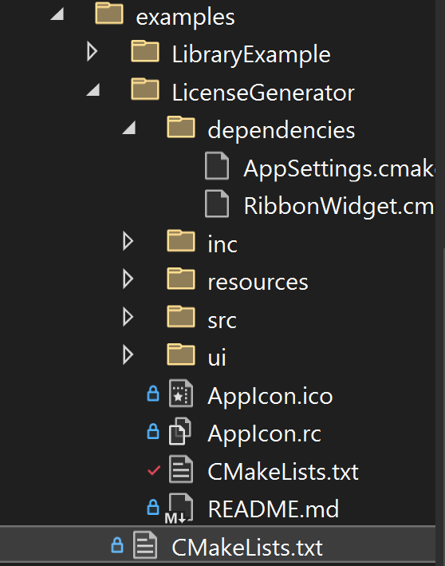

# Example folder
Each example application is located in a subfolder inside the examples folder.
Examples can be used to help a user understand how to use your library.

## Create a example project
1. Copy the folder **LibraryExample** from your template implemenation.
2. Change the name of the folder to something else. The name of the folder will automaticly be the same name as the resulting executable.
3. Implement your example...

The example will have an icon, you can change it by changing the **AppIcon.ico** file.<br>

## Additional dependencies
If you need additional dependencies that are not included in the dependency of the library, you can add them manually.<br>
Inside the ExampleProject folder, create a subdirectory called "dependencies".
Add the needed dependencyXX.cmake files in that folder.
<div style="text-align: center;">
	
</div>

Inside the CMakeLists.txt include the dependencies:
``` cmake
## USER_SECTION_START 3
include(dependencies/RibbonWidget.cmake)
include(dependencies/AppSettings.cmake)
## USER_SECTION_END

list(APPEND ADDITIONAL_LIBRARIES ${DEPENDENCIES_FOR_STATIC_LIB}) 

## USER_SECTION_START 4

## USER_SECTION_END

## Do not change the first 2 parameters             
##             Do not change      Do not change      
##                 V                  V
exampleMaster(${LIBRARY_NAME} ${LIB_PROFILE_DEFINE} ${QT_ENABLE} ${QT_DEPLOY} "${QT_MODULES}" "${ADDITONAL_SOURCES}" "${ADDITIONAL_LIBRARIES}" "${INSTALL_BIN_PATH}")
```
