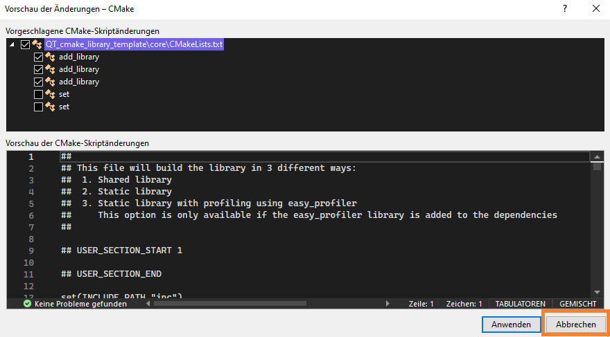
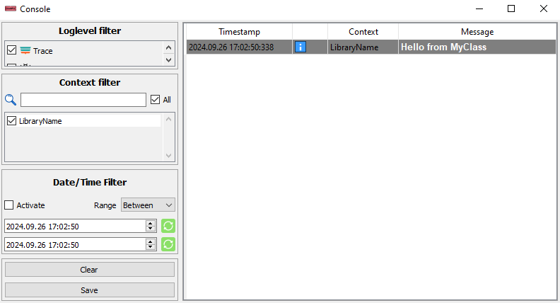

# Implementing your library code


## File location
Library files are located in the `core` directory.
* Headers are located in `core/inc`
* sources are located in `core/src`
* ui files are located in `core/ui` (must be created if needed)
* resources are located in `core/resources`
  
> ⚠️When you create a new file, CMake asks you to add the file to the source list. <br>
**Do not accept that** because the template library's CMake files are built so, that they scan the whole folder for source files. 

<div style="text-align: center;">
    
</div>

You can create a folder tree inside the `core` folder. The CMake files of the template will search recursive all directories in the `core` folder to find all filetypes that are needed to build the library.

## Example class implementation

``` C++ 
// MyClass.h
#pragma once
#include "LibraryName_base.h"

namespace LibraryNamespace
{
    class LIBRARY_NAME_API MyClass
    {
        public:
            MyClass();
            ~MyClass(); 
    	    void printMessage();
    	private:
    };
}
```
* All your library headers shuld include the `#include "LibraryName_base.h"`
* All your library specific code is contained within a library namespace. This helps to encapsulate the project from other projects.
* To be able to create a dll, you need to add the `LIBRARY_NAME_API` macro in front of the class name.

``` C++
// MyClass.cpp
#include "MyClass.h"

namespace LibraryNamespace
{
    MyClass::MyClass()
    {
    }   
    MyClass::~MyClass()
    {
    }

    void MyClass::printMessage()
    {
    	Logger::logInfo("Hello from MyClass");
    }
}
```
After you have created new files in your library, you have to reconfigure the CMake cache. 
Otherwise CMake will not detect the new added files.

---
``` C++
#pragma once

/// USER_SECTION_START 1

/// USER_SECTION_END

#include "LibraryName_info.h"

/// USER_SECTION_START 2
#include "MyClass.h"

/// USER_SECTION_END
```
In order to make your class available for the user, add your header to the `LibraryName.h`.
Using this trick, the user that uses the library only neads to include one file which is called like the library.

---

``` C++
#include <QApplication>
#include "LibraryName.h"

int main(int argc, char* argv[])
{
	QApplication app(argc, argv);

	Log::UI::createConsoleView(Log::UI::qConsoleView);
	Log::UI::QConsoleView::getStaticInstance()->show();

	LibraryNamespace::MyClass myClass;
	myClass.printMessage();

	return app.exec();
}
```
This is a example code to test the `MyClass`.
In the next picture you can see the output of the application.

<div style="text-align: center;">
    
</div>

---

## Debugging functionality
[click here to visit this chapter](loggerIntegration.md)

## Profiling functionality
[click here to visit this chapter](EasyProfilerIntegration.md)