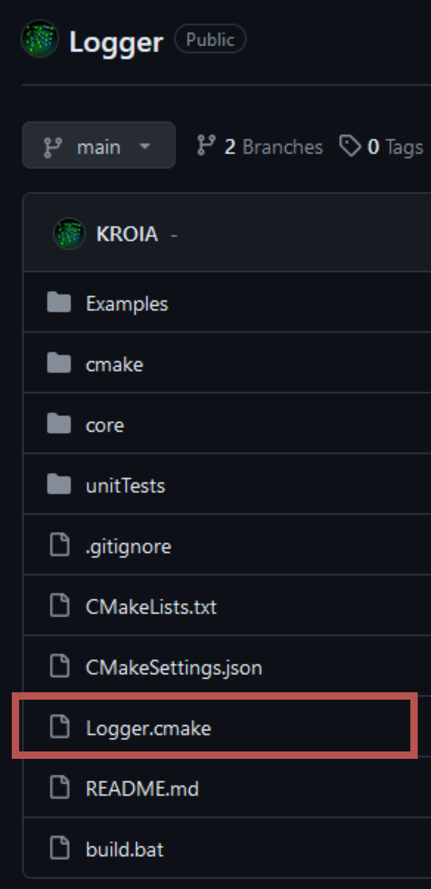
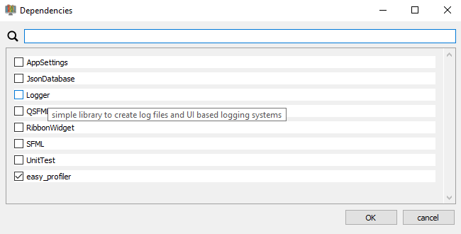

# Dependencies {#dependencies}
To be able to add external dependencies, the CMake build script will automaticly read all cmake files inside the folder:
**LibraryRoot/dependencies**<br>
Each dependency has its own cmake file that specifies where CMake can download the sources to the dependency.
The download will be locaded in the folder:
**LibraryRoot/dependencies/cache**<br>


## Requirements
- Your dependency must be available on github
- You need a [dependency CMake file](#dependencyCmakeFile) for your dependency
  
## How to add a dependency to my library project?
1. Check if your dependency already has a dependency cmake file.
   For my personal libraries, I put that file to the root repository path:<br>
   <br>
   If no such file is available, [click here](#Create-a-dependency-file)

2. Add the dependency cmake file to the directory:
   **LibraryRoot/dependencies**

3. Rebuild the CMake cache by clicking 
   **Visual Studio -> Project->"Clear cache and reconfigure"**
   This will download the dependency.


## Create a dependency file
If your dependency is built using this library template you can continue here.
**If** your dependency is **not created using this library template, [click here](#Create-a-dependency-file-from-special-repository)**.
1. Create a new cmake text document and give it the name of the dependency.
2. Copy the content from the [template file](https://raw.githubusercontent.com/KROIA/QT_cmake_library_template/main/dependencies/DependencyTemplate.cmake).
3. Change the description to fit your dependency. The description is used as tooltip in the [Cmake Library Creator](https://github.com/KROIA/CmakeLibCreator)<br>
    ``` cmake
    ## description: This is a example description which is visible as tooltip in the CmakeLibraryCreator
    ```
4. Change the variables **LIB_NAME**, **LIB_MACRO_NAME**, **GIT_REPO** and **GIT_TAG**<br>
    - **LIB_NAME**: Is the name of the library, you can find the name in the root CMakeLists.txt file:<br>
    ``` cmake
    ...
    # Name of the library
    set(LIBRARY_NAME Logger)                   # <AUTO_REPLACED>
    ...
    ```
    - **LIB_MACRO_NAME**: Macro name that is defined by the compiler to enable code sections inside the library. For example, enabeling the Logger integration if it available.<br>
    - **GIT_REPO**: Link to the repository of the dependency.
    - **GIT_TAG**: The name of the tag/branch you want to use.
5. Save the file.
6. Recommended: Copy the created file to the repositories root folder, so others which want to use your library can download your dependency cmake file.<br>
   Additional you can contact me so I can add your dependency file to the list of all dependencies available for the use in the [Cmake Library Creator](https://github.com/KROIA/CmakeLibCreator).<br>
   The dependency file will then be saved to the [Dependencies repository](https://github.com/KROIA/QT_cmake_library_template/tree/dependencies).

## Create a dependency file from special repository {#Create-a-dependency-file-from-special-repository}
To demonstate how to create the dependency cmake file, I use the [easy_profiler library](https://github.com/yse/easy_profiler) as example.
1. Create a new cmake text document and give it the name of the dependency.
2. Copy the content from the [template file](https://raw.githubusercontent.com/KROIA/QT_cmake_library_template/main/dependencies/DependencyTemplate.cmake).
3. Change the description to fit your dependency. The description is used as tooltip in the [Cmake Library Creator](https://github.com/KROIA/CmakeLibCreator)<br>
    ``` cmake
    ## description: This is a example description which is visible as tooltip in the CmakeLibraryCreator
    ```
4. Change the variables **LIB_NAME**, **GIT_REPO** and **GIT_TAG** 
    - **LIB_NAME**: Is the name of the library, you have to search the name of the dependency in the documentation of the creator of that library.<br>
    It would be that name you would need to link to your target.<br>
    - **GIT_REPO**: Link to the repository of the dependency.
    - **GIT_TAG**: The name of the tag/branch you want to use.<br>
    ``` cmake
    # Define the git repository and tag to download from
    set(LIB_NAME easy_profiler)
    set(GIT_REPO https://github.com/yse/easy_profiler.git)
    set(GIT_TAG develop)
    ```
    If your library does not exist on github, remove the part with the FetchContent_Declare. You just need to make your library available in this file, using the LIB_NAME as target name.
    

5. Depending on your dependency, you may have to define/change some settings from the dependency. 
I recommend you to test your dependency in a separate CMake project to know which settings to that library have to be done in order to work.
   In the example of the easy_profiler it would be the following changes:<br>
   ``` cmake
    # Deploy the Profiler GUI
    if(QT_ENABLE AND QT_DEPLOY)
        windeployqt(profiler_gui ${INSTALL_BIN_PATH})
    endif()

    set_target_properties(${LIB_NAME} PROPERTIES CMAKE_RUNTIME_OUTPUT_DIRECTORY ${RUNTIME_OUTPUT_DIRECTORY})
    set_target_properties(${LIB_NAME} PROPERTIES CMAKE_LIBRARY_OUTPUT_DIRECTORY ${RUNTIME_OUTPUT_DIRECTORY})
    set_target_properties(${LIB_NAME} PROPERTIES CMAKE_ARCHIVE_OUTPUT_DIRECTORY ${RUNTIME_OUTPUT_DIRECTORY})
    set_target_properties(${LIB_NAME} PROPERTIES DEBUG_POSTFIX ${DEBUG_POSTFIX_STR})
    target_compile_definitions(${LIB_NAME} PUBLIC EASY_PROFILER_STATIC)
    ```
    - You can use the **QT_ENABLE** and **QT_DEPLOY** parameters, which are defined in the root CMakeLists.txt of your library, to check if QT is enabled and if the deployment is activated.
    In the case of the easy_profiler, which contains a QT application, I wan't to deploy that executable so I can use the easy_profiler gui.
    To do so, the function **windeployqt** is called.

    - The output path for the easy_profiler is also changed...
    - A custom target definition to make easy_profiler a static build is also done here.

    - If you only need that dependency for cirtain build configurations (shared, static, static-profile).
      You can switch between the build configurations in Visual Studio -> X64-Debug Dropdown menue at the left of the "start" button.
      You can specify which configuration uses your dependency with this code:<br>
    ``` cmake
    # Add this library to the specific configurations of this project
    list(APPEND DEPENDENCIES_FOR_SHARED_LIB )   # easy_profiler is not needed for the shared profile
    list(APPEND DEPENDENCIES_FOR_STATIC_LIB )   # easy_profiler is not needed for the static profile
    list(APPEND DEPENDENCIES_FOR_STATIC_PROFILE_LIB ${LIB_NAME}) # only used for static profiling profile
    ```

6. Save the file.
7. Optional: you can contact me so I can add your dependency file to the list of all dependencies available for the use in the [Cmake Library Creator](https://github.com/KROIA/CmakeLibCreator).
   The dependency file will then be saved to the [dependencies repository](https://github.com/KROIA/QT_cmake_library_template/tree/dependencies).


### Dependency CMake File example {#dependencyCmakeFile}
Here you can see the content of the Logger library dependency cmake file.<br>
``` cmake
## description: simple library to create log files and UI based logging systems
include(FetchContent)

function(dep LIBRARY_MACRO_NAME SHARED_LIB STATIC_LIB STATIC_PROFILE_LIB)
    # Define the git repository and tag to download from
    set(LIB_NAME Logger)
    set(LIB_MACRO_NAME LOGGER_LIBRARY_AVAILABLE)
    set(GIT_REPO https://github.com/KROIA/Logger.git)
    set(GIT_TAG main)

    FetchContent_Declare(
        ${LIB_NAME}
        GIT_REPOSITORY ${GIT_REPO}
        GIT_TAG        ${GIT_TAG}
    )

    set(${LIB_NAME}_NO_EXAMPLES True)
    set(${LIB_NAME}_NO_UNITTESTS True)
    message("Downloading dependency: ${LIB_NAME} from: ${GIT_REPO} tag: ${GIT_TAG}")
    FetchContent_MakeAvailable(${LIB_NAME})

    # Add this library to the specific profiles of this project
    list(APPEND DEPS_FOR_SHARED_LIB ${LIB_NAME}_shared)
    list(APPEND DEPS_FOR_STATIC_LIB ${LIB_NAME}_static)
    list(APPEND DEPS_FOR_STATIC_PROFILE_LIB ${LIB_NAME}_static_profile) # only use for static profiling profile

    set(${LIBRARY_MACRO_NAME} "${${LIBRARY_MACRO_NAME}};${LIB_MACRO_NAME}" PARENT_SCOPE)
    set(${SHARED_LIB} "${${SHARED_LIB}};${DEPS_FOR_SHARED_LIB}" PARENT_SCOPE)
    set(${STATIC_LIB} "${${STATIC_LIB}};${DEPS_FOR_STATIC_LIB}" PARENT_SCOPE)
    set(${STATIC_PROFILE_LIB} "${${STATIC_PROFILE_LIB}};${DEPS_FOR_STATIC_PROFILE_LIB}" PARENT_SCOPE)
endfunction()

dep(DEPENDENCY_NAME_MACRO DEPENDENCIES_FOR_SHARED_LIB DEPENDENCIES_FOR_STATIC_LIB DEPENDENCIES_FOR_STATIC_PROFILE_LIB)

``` 

#### Description text
``` cmake
## description: simple library to create log files and UI based logging systems
```
<br>
The description text will be visible as tooltip in the dependencies window of the [Cmake Library Creator](https://github.com/KROIA/CmakeLibCreator).
#### Git parameters
``` cmake
# Define the git repository and tag to download from
set(LIB_NAME Logger)
set(GIT_REPO https://github.com/KROIA/Logger.git)
set(GIT_TAG main)
```
Parameters needed for the [FetchContent_Declare](https://cmake.org/cmake/help/latest/module/FetchContent.html) function from CMake.

#### Library configuration
``` cmake
set(${LIB_NAME}_NO_EXAMPLES True)
set(${LIB_NAME}_NO_UNITTESTS True)
```
These parameters are available to change in libraries, created using this library template.
It activates/deactivates the inclusion of the examples and unit tests of the dependency.
Often both, examples and unittests are not needed and only produce an compilation overhead.
It also eliminates the problem that sometimes examples or unit tests have the same cmake target name as the examples or unit tests of the library you are working on. In this case, cmake configuration would fail.

#### Linker list
``` cmake
# Add this library to the specific configurations of this project
list(APPEND DEPENDENCIES_FOR_SHARED_LIB ${LIB_NAME})   
list(APPEND DEPENDENCIES_FOR_STATIC_LIB ${LIB_NAME})  
list(APPEND DEPENDENCIES_FOR_STATIC_PROFILE_LIB ${LIB_NAME}) 
```
Each configuration profile has its own dependency list.
Usually your library needs the dependency for all configurations but in some cases like the profiler, you don't want to link the profiler to the non profiling version of your library build.